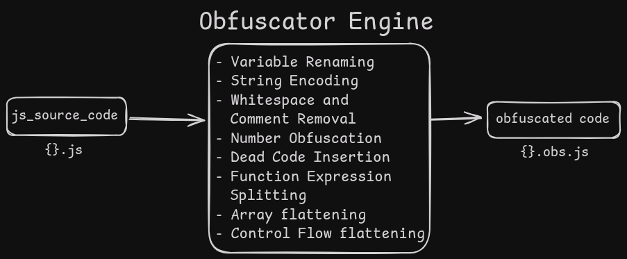

# Rustfuscator



Rustfuscator is a command-line tool written in Rust that obfuscates JavaScript code to make it more difficult to read or reverse-engineer. The tool applies a combination of techniques, including variable renaming, string encoding, number obfuscation, dead code insertion, and function splitting to create a highly obfuscated output.

## Features

- **Variable Obfuscation**: Renames variables to random strings to make the code harder to understand.
- **String Encoding**: Encodes string literals in Base64 to hide their content.
- **Number Obfuscation**: Obfuscates numbers by turning them into complex arithmetic expressions.
- **Dead Code Insertion**: Inserts meaningless junk code into the function body to make reverse-engineering more difficult.
- **Function Splitting**: Splits function logic into smaller parts and inserts junk code in between.
- **Whitespace and Comment Removal**: Strips comments and unnecessary whitespace to reduce code readability.

## Table of Contents

- [Installation](#installation)
- [Usage](#usage)

## Installation

1. Ensure you have **Rust** installed. If not, follow [this link](https://www.rust-lang.org/tools/install) to install it.
2. Clone the repository:
   ```bash
   git clone https://github.com/zokhcat/rustfuscator.git
   cd rustfuscator
   ```
3. Build the project:
   ```bash
   cargo build --release
   ```

## Usage

Once you've built the project, you can use the tool to obfuscate your JavaScript files.

```bash
./rustfuscator --input <input_file.js> --output <output_file.obs.js>
```

- --input, -i: Path to the input JavaScript file that you want to obfuscate.
- --output, -o: Path where the obfuscated JavaScript file will be saved.

Example

```bash
./rustfuscator --input sample.js --output sample.obs.js
```

This will read the sample.js file, apply various obfuscation techniques, and save the result in sample.obs.js.

Future Todos:

- [x] Variable Renaming
- [x] String Encoding
- [x] Control Flow Flattening
- [x] Whitespace and Comment Removal
- [x] Number Obfuscation
- [x] Dead Code Insertion
- [x] Function Expression Splitting
- [x] Array/Object Flattening
- [ ] Encrypting JS code(Going to remove, don't see the point of encrypting)

Libraries that I am going to use:

- [regex](https://crates.io/crates/regex) for pattern defining
- [rand](https://crates.io/crates/rand) for random insertion
- [base64](https://crates.io/crates/base64) for variable encoding and [hex](https://crates.io/crates/hex) to encode strings
- [clap](https://crates.io/crates/clap) for CLI
